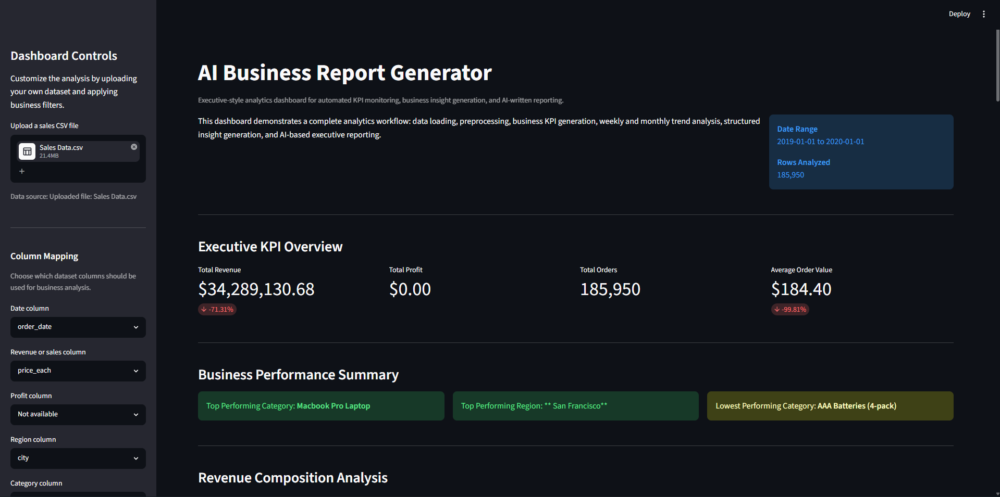
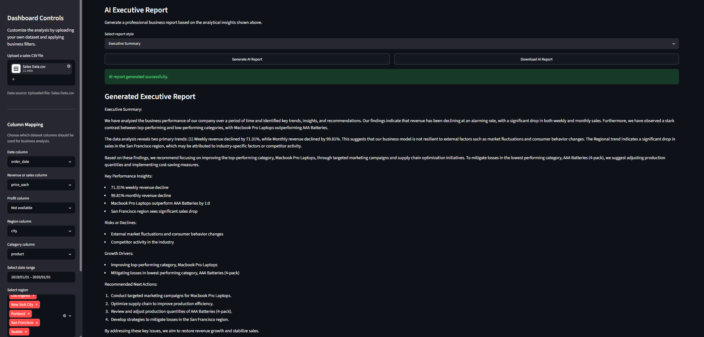

# 🚀 AI-Powered Business Report Generator


---

## 🎥 Demo Video

👉 **Watch the complete project here**

**https://youtu.be/oCX3OemNhi4**

---

## 📂 GitHub Repository

**https://github.com/anmol-janmejay/AI-Powered-Business-Report-Generator**

---

# Overview

AI-Powered Business Report Generator is an end-to-end business analytics platform that transforms raw sales datasets into executive-ready business reports using traditional data analytics and Generative AI.

The application automatically cleans uploaded datasets, computes business KPIs, performs trend analysis, extracts structured business insights, and generates professional executive summaries using a locally hosted Llama 3.2 language model via Ollama.

Designed for Data Analysts, Business Analysts, Business Intelligence professionals, and AI Engineers, the project demonstrates how AI can automate repetitive reporting workflows while supporting business decision-making.

---

## Dashboard Preview

## Executive KPI Dashboard



---

## AI Executive Report



---

# Key Highlights

- End-to-end AI-powered business analytics workflow
- Interactive Streamlit dashboard
- Dynamic CSV column mapping
- Automatic KPI generation
- Weekly and monthly trend analysis
- Business insight generation
- AI-generated executive reports
- Local LLM integration using Ollama
- Downloadable reports
- Fallback reporting when AI is unavailable

---

# Business Problem

Business teams often spend hours manually:

- Cleaning raw sales data
- Calculating KPIs
- Creating dashboards
- Identifying trends
- Writing executive summaries

This project automates the complete workflow by combining business analytics with Generative AI.

---

# Core Features

## 📂 Data Upload

Supports:

- CSV datasets
- Multiple dataset formats
- Automatic column mapping
- Manual mapping override

---

## 🧹 Data Cleaning

Automatically performs:

- Missing value handling
- Data type conversion
- Invalid record handling
- Dataset validation
- Standardization

---

## 📈 KPI Generation

Automatically calculates:

- Total Revenue
- Total Profit
- Total Orders
- Average Order Value

---

## 📊 Business Analysis

Generates:

- Revenue by Category
- Revenue by Region
- Weekly Revenue Trends
- Monthly Revenue Trends
- Growth & Decline Percentage

---

## 🤖 AI Executive Report

Uses:

- Ollama
- Llama 3.2:1b

to generate:

- Executive Summary
- Sales Report
- Risk Analysis
- Action Plan

---

## 📥 Downloads

Users can download:

- Filtered Dataset
- AI Business Report

---

# Dashboard Filters

Supports filtering by:

- Date Range
- Region
- Product Category
- Uploaded Dataset

---

# System Architecture

```text
             CSV Dataset
                  │
                  ▼
          Data Loading Module
                  │
                  ▼
          Data Cleaning Module
                  │
                  ▼
         Dynamic Column Mapping
                  │
                  ▼
          KPI Calculations
                  │
                  ▼
        Trend Analysis Engine
                  │
                  ▼
     Structured Business Insights
                  │
                  ▼
      Ollama (Llama 3.2 Local LLM)
                  │
                  ▼
      Executive Business Report
                  │
        ┌─────────┴─────────┐
        ▼                   ▼
 Streamlit Dashboard   Download Report
```

---

# Project Workflow

```text
Upload CSV
      │
      ▼
Validate Dataset
      │
      ▼
Clean Data
      │
      ▼
Map Dataset Columns
      │
      ▼
Generate KPIs
      │
      ▼
Business Trend Analysis
      │
      ▼
Structured Insights
      │
      ▼
AI Report Generation
      │
      ▼
Interactive Dashboard
      │
      ▼
Download Report
```

---

# Technology Stack

| Category | Technologies |
|-----------|--------------|
| Programming Language | Python |
| Dashboard | Streamlit |
| Data Processing | Pandas, NumPy |
| Visualization | Plotly |
| AI Integration | Ollama |
| Language Model | Llama 3.2 |
| API | Requests |
| Version Control | Git, GitHub |

---

# Skills Demonstrated

## Data Analytics

- Data Cleaning
- Data Wrangling
- KPI Generation
- Exploratory Data Analysis
- Business Analytics
- Time-Series Analysis

## Artificial Intelligence

- LLM Integration
- Prompt Engineering
- Business Report Generation
- AI Workflow Automation

## Dashboard Development

- Streamlit
- Interactive Filtering
- KPI Cards
- Data Visualization

## Software Engineering

- Modular Python Architecture
- Error Handling
- Dynamic Dataset Mapping
- File Export
- Clean Project Structure

---

# Example KPIs

- Total Revenue
- Total Profit
- Total Orders
- Average Order Value
- Weekly Growth
- Monthly Growth

---

# Example Business Insights

- Best Performing Region
- Best Performing Category
- Lowest Performing Category
- Monthly Revenue Trend
- Weekly Sales Trend

---

# Why Ollama?

This project uses a local LLM instead of cloud APIs because:

- No API key required
- No subscription cost
- Data remains local
- Faster demonstrations
- Better portfolio project

---

# Installation

Clone the repository

```bash
git clone https://github.com/anmol-janmejay/YOUR_GITHUB_REPO_LINK.git
```

Move inside the project

```bash
cd YOUR_PROJECT_FOLDER
```

Create a virtual environment

```bash
python -m venv .venv
```

Activate it

Windows

```bash
.venv\Scripts\activate
```

Install dependencies

```bash
pip install -r requirements.txt
```

Install Ollama

https://ollama.com

Download the model

```bash
ollama pull llama3.2:1b
```

Run the application

```bash
streamlit run app.py
```

---

# Future Improvements

- PDF Report Export
- SQL Database Support
- Excel File Support
- Forecasting Models
- AI Recommendations
- User Authentication
- Scheduled Reports
- Power BI Export
- Cloud Deployment
- Multi-user Support

---

# Resume Description

Developed an end-to-end AI-powered business analytics platform that transforms raw sales datasets into executive-ready reports through automated KPI generation, trend analysis, interactive dashboards, and LLM-based business insight generation using Python, Streamlit, Pandas, and Ollama.

---

# Author

## Anmol Janmejay

**Aspiring Data Analyst | Business Intelligence | AI & Data Analytics**

📧 anmol.janmejay@gmail.com

💼 LinkedIn

https://www.linkedin.com/in/anmol-janmejayyy/

🐙 GitHub

https://github.com/anmol-janmejay

---

# ⭐ If you found this project useful, consider giving it a star!
